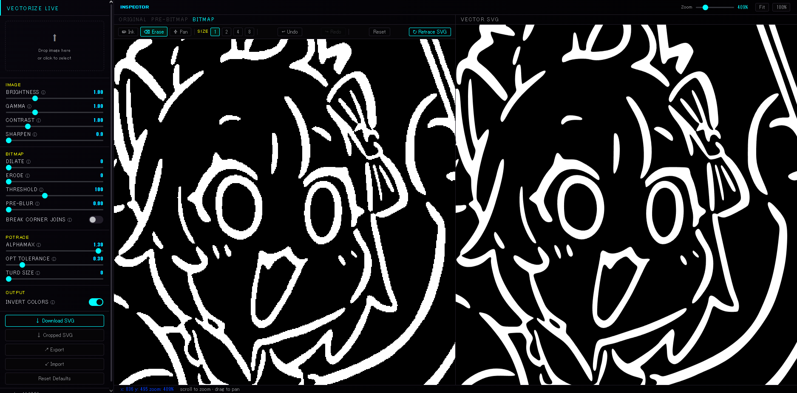

# Vectorizer

A browser-based image-to-SVG tool powered by [potrace](http://potrace.sourceforge.net/). Drop in a raster image, mess with the sliders, and get a clean SVG back — all running locally, no uploads.



## Features

Every slider change rerenders the SVG on the fly (debounced ~280 ms). The viewer has three tabs — Original, the pre-threshold bitmap, and an editable B&W canvas — sitting next to the SVG output so you can see exactly what's happening at each stage.

The bitmap editor lets you paint or erase pixels before retracing, which is handy for cleaning up noise or fixing details potrace misses:

- Ink, Erase, and Pan tools
- Brush sizes: 1×1, 2×2, 4×4, 8×8 px
- Shift+click snaps a straight line from your last point (with a live preview)
- Green cursor = ink, red = erase
- 30-step undo/redo

Other bits: mouse-wheel zoom, middle-click pan, crosshair guides, and full session save/restore as a `.json` file.

There's also a CLI if you'd rather skip the browser entirely: `python server.py input.png output.svg`

## Setup

You'll need Python 3.9+, [Flask](https://flask.palletsprojects.com/), [Pillow](https://pillow.readthedocs.io/), and [potrace](http://potrace.sourceforge.net/).

**Installing potrace:**

| OS | How |
|---|---|
| **Windows** | Grab `potrace.exe` from [potrace.sourceforge.net](http://potrace.sourceforge.net/#downloading) and drop it in the project folder, or add it to `PATH` |
| **macOS** | `brew install potrace` |
| **Linux** | `sudo apt install potrace` / `sudo dnf install potrace` |

> Drop `potrace.exe` / `potrace` next to `server.py` and it'll be used over whatever's on your `PATH`.

```bash
git clone https://github.com/umittadelen/vectorizer.git
cd vectorizer
pip install flask Pillow
python server.py
```

That's it — the browser opens automatically. Supports PNG, JPEG, BMP, TIFF, and WebP.

By default the server binds to `127.0.0.1:8080`. To change the host or port, create a `.ip` file in the project folder:

```
192.168.1.50:8080
```

The `.ip` file is gitignored, so your local address never ends up in the repo.

## CLI

```bash
python server.py input.png output.svg
python server.py input.png output.svg --threshold 128 --blur 0.5 --no-invert
```

Run `python server.py --help` for all options.

## Parameters

| Parameter | Range | What it does |
|---|---|---|
| Threshold | 0 – 255 | Ink/paper cutoff after tonal adjustments |
| Blur | 0 – 5 | Gaussian blur before thresholding |
| Brightness | 0.1 – 3 | Lightness multiplier |
| Gamma | 0.1 – 3 | Gamma curve correction |
| Contrast | 0.1 – 3 | Contrast multiplier |
| Sharpen | 0 – 5 | Unsharp-mask strength |
| Dilate | 0 – 10 | Expand ink regions |
| Erode | 0 – 10 | Shrink ink regions |
| Alpha max | 0 – 1.34 | potrace corner-smoothing |
| Opt tolerance | 0 – 1 | potrace curve-optimisation |
| Turd size | 0 – 100 | Minimum speckle size to suppress |
| Invert | toggle | Swap ink and paper before tracing |
| Corner break | toggle | Breaks diagonal-only pixel connections |

## Keyboard shortcuts

These only apply when the **Bitmap** tab is open.

| Key | Action |
|---|---|
| `I` | Ink tool |
| `E` | Erase tool |
| `P` / `Space` | Pan tool |
| `1` `2` `3` `4` | Brush size 1 / 2 / 4 / 8 px |
| `[` `]` | Cycle brush size |
| `Shift` + click | Straight line from last point |
| `Ctrl+Z` | Undo |
| `Ctrl+Y` / `Ctrl+Shift+Z` | Redo |

## Saving sessions

**↗ Export** saves a `.vectorize.json` with your slider values, the original image, the bitmap canvas state, and the full undo/redo history. Drag it back onto the page or hit **↙ Import** to pick up where you left off.

## License

MIT — see [LICENSE](LICENSE)
